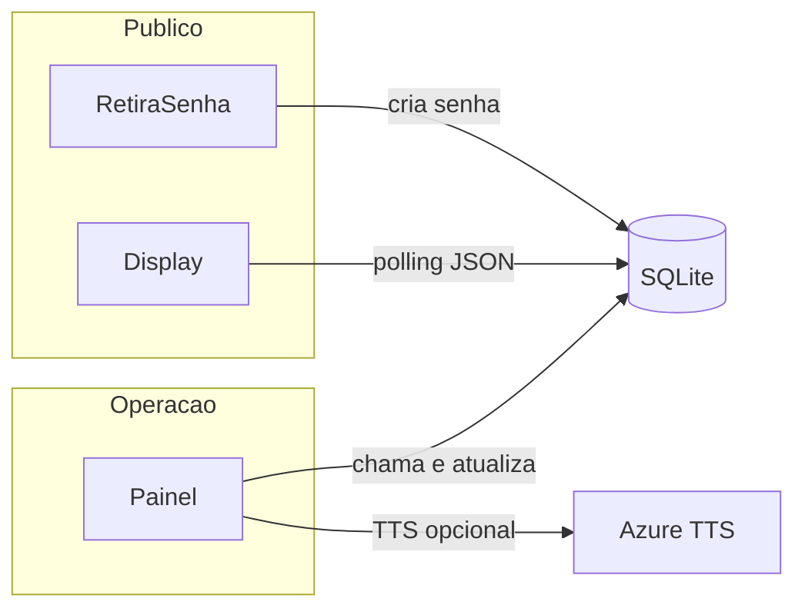

# Contexto do sistema (Sistema de Senhas IAAM)

Este documento complementa o [README.md](README.md): aqui estão **finalidade**, **arquitetura** e **pontos de entrada no código**. Para instalação, comandos e lista marketing de recursos, use o README.

## Visão geral

Aplicação web para **fila de atendimento por senhas** no contexto do **IAAM**. O fluxo cobre:

- **Retirada de senha** pelo público (tipos **normal** e **preferencial**). As siglas podem ser `NP`/`NR` (normal, primeira vez ou não) e `PP`/`PR` (preferencial), conforme a tela/API usada; [app/routes.py](app/routes.py) implementa `/api/retirar` (fluxo simplificado) e `/api/gerar_senha` (triagem com parâmetro `primeira`).
- **Painel operacional** para chamadas, guichê e ações de fila.
- **Display público** com última chamada, fila e recursos visuais (vídeo, playlist, opcionalmente canal Pluto TV).
- **Relatórios** e exportações.
- **TTS** (síntese de voz) para chamadas.
- **Impressão** em impressoras térmicas via rede (ESC/POS).

## Stack e execução

| Item | Detalhe |
|------|---------|
| Framework | Flask, factory em [app/__init__.py](app/__init__.py) |
| ORM / DB | SQLAlchemy; SQLite por padrão (`sqlite:///sistema.db` em [app/config.py](app/config.py)) |
| Sessão / login | Flask-Login; `LoginManager` com `login_view = 'main.login'` |
| Blueprints | `main` em [app/routes.py](app/routes.py); TTS auxiliar em [app/tts_routes.py](app/tts_routes.py) (`/tts_audio`) |
| Entrada | [run.py](run.py): `host="0.0.0.0"`, porta **5003**, `threaded=True`, `debug=False` |

Variáveis úteis: `FLASK_CONFIG`, `DATABASE_URL`, `SECRET_KEY` (ver [app/config.py](app/config.py)).

## Domínio de dados

Definições em [app/models.py](app/models.py):

- **`Usuario`** — `nome`, `email`, `senha` (hash), `tipo` enum `Papel`: `admin` ou `usuario`. Propriedade `is_admin`.
- **`Senha`** — fila: `numero`, `sigla`, `tipo_paciente` (`normal` / `preferencial`), `primeira_vez`, `gerado_em`, `chamado`, `chamado_por`, `chamado_em`, `guiche`. Índices para consultas por chamada e tipo.
- **`ConfiguracaoSistema`** — uma linha conceitual de configuração: cores e textos do display, voz TTS, **modo de prioridade** (`intercalamento`, `peso`, `alternancia`) e parâmetros associados, playlist de vídeos, integração **TV** (Pluto), IPs/portas das **impressoras**.
- **`VideoPlaylist`** — itens de playlist (arquivo, ordem, duração, ativo).

Canais Pluto TV usados pelo display estão catalogados em [app/pluto_channels.py](app/pluto_channels.py).

## Autenticação e controle de acesso

- Decorator **`role_required`** em [app/auth_utils.py](app/auth_utils.py): restringe rota por `current_user.tipo`; caso contrário responde **403** (handler em [app/__init__.py](app/__init__.py)).
- **Rotas “livres”** (sem exigir o fluxo de inatividade da sessão para o mesmo conjunto de regras do `before_request`): definidas em `rotas_livres` dentro de `controlar_sessao_por_inatividade` em [app/routes.py](app/routes.py), por exemplo `display`, `retira_senha`, `fila_json`, `ultima_chamada`, `ping`, várias APIs (`api_retira_senha`, `api_painel_action`, TTS etc.) e login.
- Sessão autenticada: atualização de `ultimo_uso`; logout após **8 horas** de inatividade (coerente com `PERMANENT_SESSION_LIFETIME` em config).

## Regras de negócio (prioridade e serviços)

Lógica central em [app/services.py](app/services.py):

- **`PrioridadeService`** — escolhe a próxima senha conforme `ConfiguracaoSistema.tipo_prioridade`:
  - **intercalamento** — após N normais (`intercalamento_valor`), força preferencial;
  - **peso** — sorteio ponderado entre filas (`peso_normal`, `peso_preferencial`);
  - **alternancia** — uso de `tolerancia_minutos` desde a última preferencial chamada.
- **`ImpressoraService`** — monta **ESC/POS** e envia por socket TCP (porta típica 9100) usando IPs da configuração; data/hora em **America/Manaus**.
- **`TTSService`** — síntese via API **Azure Cognitive Services** (voz configurável, ex.: `pt-BR-FranciscaNeural`).

**Fuso horário:** funções em [app/routes.py](app/routes.py) convertem `datetime` **UTC** para **America/Manaus** (`utc_to_brasil`) onde necessário para exibição/relatórios.

## Superfície HTTP (referência rápida)

Não é a lista completa de endpoints; serve para orientar leitura do código.

| Caminho | Papel |
|---------|--------|
| `/` | Redireciona para login |
| `/login`, `/logout` | Autenticação |
| `/retira` | Página pública de retirada de senha |
| `/api/retirar` | API de geração de senha (query `tipo`) |
| `/api/gerar_senha` | Gera senha com triagem `tipo` + `primeira` (NP/NR/PP/PR); numeração reinicia por dia |
| `/display` | Tela pública de chamadas |
| `/fila_json`, `/ultima_chamada`, `/painel_fila_json` | JSON para fila / última chamada / painel |
| `/painel` | Painel operacional |
| `/chamar_senha` | Chamada de senha (fluxo web) |
| `/api/painel_action` | Ações do painel via POST |
| `/usuarios`, `/cadastro`, `/usuarios/<id>/editar` | Gestão de usuários |
| `/edtelas`, `/salvar_config` | Editor de telas / configuração visual |
| `/prisetup`, `/salvar_prioridade` | Prioridades de senha |
| `/relatorios`, `/relatorio_personalizado`, `/gerar_relatorio` | Relatórios |
| `/api/falar`, `/api/tts` | TTS via API |
| `/tts_audio` | Blueprint TTS ([app/tts_routes.py](app/tts_routes.py)) |
| `/atualizacoes`, `/api/check_updates`, `/api/update_system`, `/api/download_updater` | Fluxo de atualização do sistema |
| `/ping` | Health/simples verificação |

Templates: [app/templates/](app/templates/). JavaScript do front: [app/static/js/](app/static/js/).

## Fluxo simplificado

## Scripts e manutenção

Utilitários na raiz e em `app/` (executar conforme necessidade e documentação interna de cada script):

- [run.py](run.py) — sobe o servidor Flask.
- [recriar_banco.py](recriar_banco.py) — recria estrutura de banco (instalação/recuperação).
- [criar_indices.py](criar_indices.py), [app/migrar_colunas.py](app/migrar_colunas.py), [migrar_impressoras.py](migrar_impressoras.py), [migrate_playlist.py](migrate_playlist.py) — migrações/ajustes pontuais.
- [atualizador_autonomo.py](atualizador_autonomo.py), [criar_exe_updater.py](criar_exe_updater.py) — atualização/automação.
- Pastas `backup_*` no repositório podem ser cópias locais antigas de configuração; tratar como legado, não como fonte ativa de verdade.

## Subprojeto `welcome-center-queue-display`

A pasta [welcome-center-queue-display/](welcome-center-queue-display/) contém um frontend **Vite + React** (README genérico de template). É **independente** do núcleo Flask: não substitui por padrão o painel/display servidos por templates em `app/templates/`.

## Integrações e segredos

- **Azure Speech (TTS)** — chave e endpoint aparecem como padrão em [app/config.py](app/config.py) e em `TTSService`; em produção, **substitua por variáveis de ambiente** e **não commite** credenciais.
- **Impressoras** — IP/porta configuráveis no banco (`ConfiguracaoSistema`) e defaults em config.
- **Pluto TV** — streams HLS públicos referenciados por ID de canal; sem autenticação de API no código mostrado.

---

*Documento alinhado ao código do repositório; ao alterar rotas ou modelos, atualize este arquivo para manter o contexto correto.*
